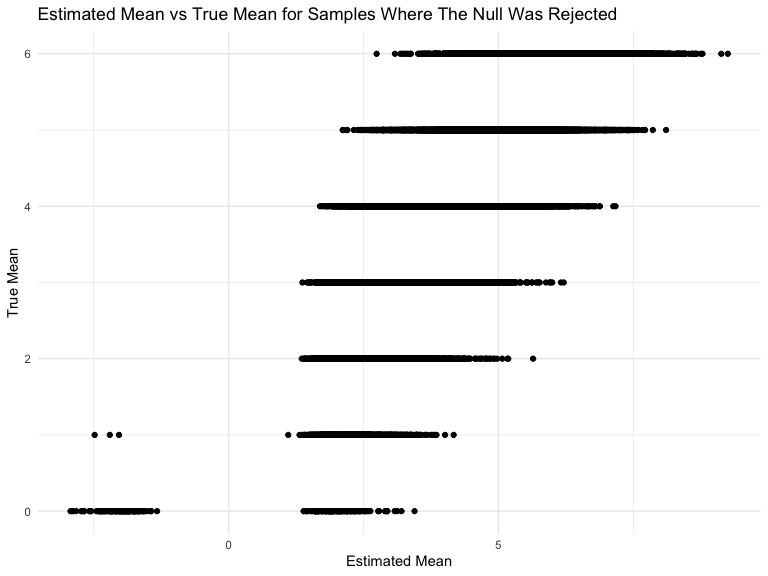

P8105 Homework 5
================
Christine Lucille Kuryla (clk2162)
2023-11-15

# Problem 1

## Import and clean data

This problem explores the proportion of homicides in several cities that
are solved/result in arrest. Let’s start by importing, cleaning, and
manipulating the data to serve our purposes.

``` r
homicide_data <- 
  read_csv("data/homicide-data.csv", na = c("", "NA", "Unknown")) %>%
  mutate(
    city_state = str_c(city, state, sep = ", "),
    resolution = case_when(
      disposition == "Closed without arrest" ~ "unsolved",
      disposition == "Open/No arrest"        ~ "unsolved",
      disposition == "Closed by arrest"      ~ "solved"
    )
  ) %>% 
  filter(city_state != "Tulsa, AL") 
```

    ## Rows: 52179 Columns: 12
    ## ── Column specification ────────────────────────────────────────────────────────
    ## Delimiter: ","
    ## chr (8): uid, victim_last, victim_first, victim_race, victim_sex, city, stat...
    ## dbl (4): reported_date, victim_age, lat, lon
    ## 
    ## ℹ Use `spec()` to retrieve the full column specification for this data.
    ## ℹ Specify the column types or set `show_col_types = FALSE` to quiet this message.

The resulting dataframe `homicide_data` has information on uid,
reported_date, victim_last, victim_first, victim_race, victim_age,
victim_sex, city, state, lat, lon, disposition, city_state, resolution
and has been cleaned.

## Proportion of unsolved homicides in Baltimore

``` r
# Proportion test to estimite the proportion of unsolved homicides in Baltimore

# filter and select relevant data

baltimore <- homicide_data %>%
  filter(city_state == "Baltimore, MD") %>%
  select(resolution) %>%
  summarize(
    hom_total = n(),
    hom_unsolved = sum(resolution == "unsolved")
  )

# perform proportion test

baltimore_prop <- 
    prop.test(
    x = baltimore %>% pull(hom_unsolved),
    n = baltimore %>% pull(hom_total)) 

broom::tidy(baltimore_prop) %>% 
  knitr::kable(digits = 3)
```

| estimate | statistic | p.value | parameter | conf.low | conf.high | method                                               | alternative |
|---------:|----------:|--------:|----------:|---------:|----------:|:-----------------------------------------------------|:------------|
|    0.646 |   239.011 |       0 |         1 |    0.628 |     0.663 | 1-sample proportions test with continuity correction | two.sided   |

The proportion of unsolved homicides in Baltimore is 0.6455607. See
above table for details.

## Proportion of unsolved homicides for all cities in dataset

Note, this code is adapted from the solutions.

``` r
# Create a df summarizing the total and unsolved number of homicides in all the cities in the dataset

city_homicide_df <- 
  homicide_data %>% 
  select(city_state, disposition, resolution) %>% 
  group_by(city_state) %>% 
  summarize(
    hom_total = n(),
    hom_unsolved = sum(resolution == "unsolved")) 

# Run proportion test on all cities and put in a new df

prop_all_cities_results <- 
  city_homicide_df %>% 
  mutate(
    prop_tests = map2(hom_unsolved, hom_total, \(x, y) prop.test(x = x, n = y)),
    tidy_tests = map(prop_tests, broom::tidy)) %>% 
  select(-prop_tests) %>% 
  unnest(tidy_tests) %>% 
  select(city_state, estimate, conf.low, conf.high) 

# plot results and CIs

prop_all_cities_results %>% 
  mutate(city_state = fct_reorder(city_state, estimate)) %>% 
  ggplot(aes(x = city_state, y = estimate)) + 
  geom_point() + 
  geom_errorbar(aes(ymin = conf.low, ymax = conf.high)) + 
  theme(axis.text.x = element_text(angle = 90, hjust = 1))
```


# Problem 2

This problem analyzes a control and experimental arm over time, where
the subjects’ data is in separate files.

``` r
# import and combine data

files <- list.files("./data/data-3/")

# create a table in a for loop

output <- vector("list", length = length(files))
for (i in 1:length(files)) {
  output[[i]] =  read_csv(str_c("./data/data-3/", files[i]))
}

# let's do this with purr:map as well as including the name as a corresponding list

experiment_df <- tibble(
  file_name = files,
  subj_data = map_df(file_name, \(x) read_csv(str_c("./data/data-3/", x)))  
)

experiment_df <- experiment_df %>% 
  unnest(subj_data) %>% 
  mutate(group = str_sub(file_name, 1, 3)) %>% 
  mutate(id = str_sub(file_name, 1, 6)) %>% 
  mutate(group = case_when(
      group == "con" ~ "control",
      group == "exp" ~ "experimental"
      )) %>% 
  pivot_longer(cols = week_1:week_8,
               names_to = "week",
               values_to = "value") %>% 
  mutate(week = str_sub(week, 6,6)) %>% 
  mutate(week = as.numeric(week)) %>% 
  select(-file_name) %>% 
  relocate(id)
```

The data has been imported by itering over file name using a function,
then extracting the values for each week from the imported df, then
extracting the group from the name of the file, and finally cleaned and
tidied. The final dataframe has the columns id, group, week, value.

Now we will visualize the data.

``` r
# spaghetti plot of observations on each subject over time

experiment_df %>% 
  group_by(id) %>% 
  ggplot(aes(x = week, y = value,  color = group, group = id)) +
  geom_point() +
  geom_line() +
  labs(
    title = "Spaghetti plot of value over time",
    x = "Week",
    y = "Observed Value"
  )
```


The experimental group’s observed value seems to increase over time and
the control group’s value seems relatively constant. The intervention
probably increases whatever the outcome variable is.

# Problem 3

Prompt: When designing an experiment or analysis, a common question is
whether it is likely that a true effect will be detected – put
differently, whether a false null hypothesis will be rejected. The
probability that a false null hypothesis is rejected is referred to as
power, and it depends on several factors, including: the sample size;
the effect size; and the error variance. In this problem, you will
conduct a simulation to explore power in a one-sample t-test. First set
the following design elements:

Fix n=30 Fix σ=5 Set μ=0 . Generate 5000 datasets from the model

x∼Normal\[μ,σ\]

For each dataset, save μ̂ and the p-value arising from a test of H:μ=0
using α=0.05 . Hint: to obtain the estimate and p-value, use broom::tidy
to clean the output of t.test.

Repeat the above for μ={1,2,3,4,5,6} , and complete the following:

Make a plot showing the proportion of times the null was rejected (the
power of the test) on the y axis and the true value of μ on the x axis.
Describe the association between effect size and power. Make a plot
showing the average estimate of μ̂ on the y axis and the true value of μ
on the x axis. Make a second plot (or overlay on the first) the average
estimate of μ̂ only in samples for which the null was rejected on the y
axis and the true value of μ on the x axis. Is the sample average of μ̂
across tests for which the null is rejected approximately equal to the
true value of μ ? Why or why not?

``` r
# Simulate model repeatedly
# The model is a normal distribution with mean 0 and sd 5
# We will sample 30 values each sampling

normal_sample <- function(mean) {
  
  # simulate data
  sample <- rnorm(n = 30, mean = mean, sd = 5)
  
  # extract parameters
  output <- tibble(
    mean_hat = mean(sample),
    p_value = broom::tidy(t.test(sample))$p.value
  )
  
  output
}

# generate 5000 datasets and their corresponding mean and p-values

output <- vector("list", 5000)

for (i in 1:5000) {
  output[[i]] = normal_sample(0)
}

sim_results <- bind_rows(output)


# View the first few results from the df
head(sim_results)
```

    ## # A tibble: 6 × 2
    ##   mean_hat p_value
    ##      <dbl>   <dbl>
    ## 1    0.273   0.786
    ## 2   -0.622   0.538
    ## 3    0.606   0.541
    ## 4    0.437   0.597
    ## 5    1.23    0.181
    ## 6    0.720   0.465

``` r
# Now do this for means 1, 2, 3, 4, 5, 6

multiple_means <- 
  expand_grid(
    mean_value = c(0, 1, 2, 3, 4, 5, 6),
    iter = 1:5000
    ) %>% 
  mutate(
    estimate_df = map(mean_value, normal_sample)
    ) %>% 
  unnest(estimate_df)

# power = proportion of times the null was rejected

# plot power versus true mean

multiple_means %>% 
  group_by(mean_value) %>% 
  summarize(total_tests = n(),
            total_rejected = sum(p_value < 0.05)
            ) %>% 
  mutate(power = total_rejected/total_tests) %>% 
  ggplot(aes (x = mean_value, y = power)) +
  geom_point() +
  geom_line() +
  ggtitle("Power level compared to true mean value")
```


``` r
  labs(x = "True Mean",
       y = "Power")
```

    ## $x
    ## [1] "True Mean"
    ## 
    ## $y
    ## [1] "Power"
    ## 
    ## attr(,"class")
    ## [1] "labels"

As the effect size increases, power increases, but the larger effect
size has less of an effect on the power as the effect size increases.

``` r
# estimated mean vs true mean for all samples

multiple_means %>% 
  ggplot(aes(x = mean_hat, y = mean_value)) +
  geom_point() +
  ggtitle("Estimated Mean vs True Mean for All Samples") +
  labs(x = "Estimated Mean",
       y = "True Mean")
```


``` r
# estimated mean vs true mean for samples where the null was rejected

multiple_means %>% 
  filter(p_value < 0.05) %>% 
  ggplot(aes(x = mean_hat, y = mean_value)) +
  geom_point() +
  ggtitle("Estimated Mean vs True Mean for Samples Where The Null Was Rejected") +
  labs(x = "Estimated Mean",
       y = "True Mean")
```


